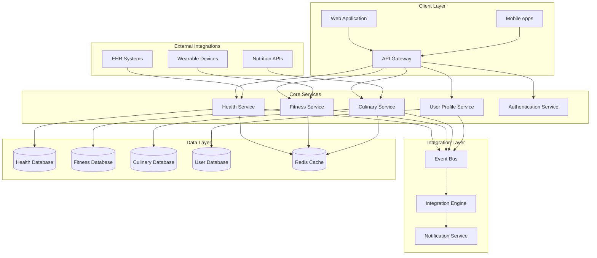

# Design Document: Integrated Wellness Platform

## Overview

The Integrated Wellness Platform is designed as a microservices-based system that seamlessly combines healthcare, fitness, and culinary domains into a unified wellness experience. The architecture emphasizes loose coupling between services while enabling rich cross-domain data integration through an event-driven communication pattern.

The system follows modern healthcare interoperability standards (FHIR/HL7) for health data exchange, implements robust security measures for sensitive health information, and provides real-time synchronization across all wellness domains. The platform is designed to scale horizontally while maintaining data consistency and providing personalized recommendations based on comprehensive user profiles.

## Architecture

### High-Level Architecture



### Architectural Patterns

**Microservices Architecture**: Each domain (health, fitness, culinary) is implemented as an independent service with its own database, enabling autonomous development and deployment while supporting different scaling requirements.

**Event-Driven Architecture**: Services communicate through asynchronous events published to a central event bus, enabling loose coupling and real-time data synchronization across domains without direct service dependencies.

**API Gateway Pattern**: A single entry point manages authentication, rate limiting, request routing, and cross-cutting concerns, simplifying client interactions and providing centralized security enforcement.

**CQRS (Command Query Responsibility Segregation)**: Read and write operations are separated to optimize performance, with event sourcing maintaining an audit trail of all wellness data changes for compliance and analytics.

## Components and Interfaces

### Core Services

#### Health Service
**Responsibilities:**
- Health metrics tracking and validation
- Medical appointment management
- Medication scheduling and adherence monitoring
- Health records storage with FHIR compliance
- Symptom tracking and pattern analysis

**Key Interfaces:**
```
POST /health/metrics - Record health measurements
GET /health/metrics/{userId} - Retrieve health data
POST /health/appointments - Schedule medical appointments
GET /health/medications/{userId} - Get medication schedules
POST /health/symptoms - Log symptom occurrences
```

**Events Published:**
- `HealthMetricRecorded` - New health measurement logged
- `MedicationTaken` - Medication adherence recorded
- `SymptomReported` - New symptom logged
- `HealthConditionUpdated` - Health status changed

#### Fitness Service
**Responsibilities:**
- Workout planning and customization
- Exercise tracking and progress monitoring
- Goal setting and achievement tracking
- Activity logging from multiple sources
- Performance analytics and insights

**Key Interfaces:**
```
POST /fitness/workouts - Create workout plans
GET /fitness/progress/{userId} - Retrieve fitness progress
POST /fitness/activities - Log physical activities
GET /fitness/goals/{userId} - Get fitness objectives
POST /fitness/programs - Access exercise programs
```

**Events Published:**
- `WorkoutCompleted` - Exercise session finished
- `FitnessGoalSet` - New fitness objective created
- `ActivityLogged` - Physical activity recorded
- `ProgressMilestoneReached` - Achievement unlocked

#### Culinary Service
**Responsibilities:**
- Recipe management and discovery
- Meal planning and scheduling
- Nutrition tracking and analysis
- Grocery list generation
- Cooking assistance and timing

**Key Interfaces:**
```
POST /culinary/recipes - Save and manage recipes
GET /culinary/meal-plans/{userId} - Retrieve meal schedules
POST /culinary/nutrition - Track nutritional intake
GET /culinary/grocery-lists/{userId} - Generate shopping lists
POST /culinary/cooking-sessions - Start cooking assistance
```

**Events Published:**
- `MealConsumed` - Nutritional intake recorded
- `MealPlanCreated` - New meal schedule generated
- `RecipeSaved` - Recipe added to collection
- `NutritionGoalUpdated` - Dietary objective changed

#### Integration Engine
**Responsibilities:**
- Cross-domain event processing and coordination
- Recommendation generation using multi-domain data
- Conflict resolution between domain suggestions
- Data consistency maintenance across services
- Personalization algorithm execution

**Key Functions:**
- Process health condition changes to update fitness recommendations
- Coordinate nutrition plans with fitness goals and health requirements
- Generate unified wellness insights from all domains
- Maintain data synchronization and consistency

### External Integrations

#### Wearable Device Integration
Supports popular fitness trackers and health monitors through standardized APIs:
- **Apple HealthKit**: iOS-native integration for comprehensive health data
- **Google Fit**: Android health platform integration
- **Fitbit API**: Direct integration with Fitbit ecosystem
- **Generic Bluetooth**: Support for additional wearable devices

#### Healthcare System Integration
FHIR-compliant interfaces for healthcare interoperability:
- **EHR Integration**: Bidirectional data exchange with electronic health records
- **Lab Results**: Automated import of laboratory test results
- **Provider Networks**: Integration with healthcare provider systems
- **Telehealth Platforms**: Support for virtual consultation platforms

#### Nutrition Data Integration
Third-party nutrition databases and services:
- **USDA FoodData Central**: Comprehensive nutrition database
- **Edamam API**: Recipe and nutrition analysis
- **Spoonacular**: Recipe discovery and meal planning
- **Barcode Scanning**: Product nutrition lookup

## Data Models

### Core Domain Models

#### User Profile
```
UserProfile {
  userId: UUID
  personalInfo: PersonalInformation
  healthConditions: HealthCondition[]
  fitnessLevel: FitnessLevel
  dietaryPreferences: DietaryPreferences
  goals: WellnessGoal[]
  privacySettings: PrivacyConfiguration
  createdAt: DateTime
  updatedAt: DateTime
}

PersonalInformation {
  name: String
  dateOfBirth: Date
  gender: Gender
  height: Measurement
  weight: Measurement
  activityLevel: ActivityLevel
}

HealthCondition {
  conditionId: UUID
  name: String
  severity: Severity
  diagnosedDate: Date
  restrictions: String[]
  medications: Medication[]
}

WellnessGoal {
  goalId: UUID
  type: GoalType (HEALTH | FITNESS | NUTRITION)
  description: String
  targetValue: Number
  currentValue: Number
  targetDate: Date
  status: GoalStatus
}
```

#### Health Domain Models
```
HealthMetric {
  metricId: UUID
  userId: UUID
  type: MetricType
  value: Number
  unit: String
  timestamp: DateTime
  source: DataSource
  notes: String?
}

MedicationSchedule {
  scheduleId: UUID
  userId: UUID
  medication: Medication
  dosage: Dosage
  frequency: Frequency
  startDate: Date
  endDate: Date?
  adherenceRate: Percentage
}

Symptom {
  symptomId: UUID
  userId: UUID
  name: String
  severity: SeverityLevel
  duration: Duration
  triggers: String[]
  timestamp: DateTime
  associatedConditions: UUID[]
}
```

#### Fitness Domain Models
```
Workout {
  workoutId: UUID
  userId: UUID
  name: String
  exercises: Exercise[]
  duration: Duration
  caloriesBurned: Number
  intensity: IntensityLevel
  completedAt: DateTime
  notes: String?
}

Exercise {
  exerciseId: UUID
  name: String
  type: ExerciseType
  muscleGroups: MuscleGroup[]
  sets: Set[]
  restPeriods: Duration[]
  modifications: String[]
}

FitnessProgress {
  progressId: UUID
  userId: UUID
  metric: FitnessMetric
  value: Number
  timestamp: DateTime
  workoutId: UUID?
  trend: TrendDirection
}
```

#### Culinary Domain Models
```
Recipe {
  recipeId: UUID
  name: String
  description: String
  ingredients: Ingredient[]
  instructions: CookingStep[]
  nutritionInfo: NutritionFacts
  prepTime: Duration
  cookTime: Duration
  servings: Number
  difficulty: DifficultyLevel
  tags: String[]
}

MealPlan {
  planId: UUID
  userId: UUID
  startDate: Date
  endDate: Date
  meals: PlannedMeal[]
  nutritionTargets: NutritionTargets
  totalCalories: Number
  macroBreakdown: MacronutrientRatio
}

NutritionEntry {
  entryId: UUID
  userId: UUID
  foodItem: FoodItem
  quantity: Measurement
  mealType: MealType
  timestamp: DateTime
  nutritionFacts: NutritionFacts
}
```

### Event Models
```
DomainEvent {
  eventId: UUID
  eventType: String
  aggregateId: UUID
  userId: UUID
  timestamp: DateTime
  version: Number
  payload: JSON
  metadata: EventMetadata
}

CrossDomainRecommendation {
  recommendationId: UUID
  userId: UUID
  sourceEvents: UUID[]
  recommendationType: RecommendationType
  targetDomain: Domain
  content: RecommendationContent
  priority: Priority
  expiresAt: DateTime
}
```

## Correctness Properties

*A property is a characteristic or behavior that should hold true across all valid executions of a system—essentially, a formal statement about what the system should do. Properties serve as the bridge between human-readable specifications and machine-verifiable correctness guarantees.*

Based on the prework analysis, the following properties capture the essential correctness requirements for the Integrated Wellness Platform:

### Core Data Management Properties

**Property 1: Timestamped Data Recording**
*For any* data entry (health metrics, symptoms, workouts, nutrition), when recorded in the system, it should be stored with accurate timestamps and proper validation of data ranges.
**Validates: Requirements 1.1, 5.1, 6.2, 10.2, 13.1**

**Property 2: Data Organization and Categorization**
*For any* data added to the system, it should be properly categorized, organized according to user preferences, and linked to related existing records.
**Validates: Requirements 4.3, 10.4, 11.2, 14.2**

**Property 3: Structured Data Storage and Export**
*For any* health records stored in the system, they should maintain a structured, searchable format and be exportable in standard medical formats while preserving data integrity.
**Validates: Requirements 4.1, 4.4**

### Cross-Domain Integration Properties

**Property 4: Cross-Domain Event Propagation**
*For any* data update in any domain (health, fitness, culinary), relevant information should be propagated to other domains to trigger appropriate cross-domain recommendations and updates.
**Validates: Requirements 1.5, 3.5, 4.5, 5.5, 8.5, 10.5, 13.5, 16.1, 16.5, 18.2**

**Property 5: Comprehensive Recommendation Generation**
*For any* recommendation generated by the system, it should consider data from all relevant domains (health, fitness, nutrition) and align with user goals and preferences.
**Validates: Requirements 11.3, 11.5, 12.1, 12.2, 13.3, 16.2**

**Property 6: Safety-First Prioritization**
*For any* conflict between recommendations or goals, the system should prioritize health and safety considerations over other objectives and suggest appropriate modifications.
**Validates: Requirements 6.5, 7.5, 9.5, 16.3**

### Scheduling and Notification Properties

**Property 7: Schedule Creation and Management**
*For any* scheduled item (appointments, medications, workouts), the system should create proper schedules with all required details and support recurring patterns.
**Validates: Requirements 2.1, 2.4, 3.1, 7.4**

**Property 8: Timely Notification Delivery**
*For any* scheduled event requiring notification, the system should send timely alerts at appropriate intervals before the scheduled time.
**Validates: Requirements 2.2, 3.2**

### Progress Tracking and Analytics Properties

**Property 9: Accurate Progress Tracking**
*For any* measurable goal or target, the system should track progress accurately, update completion percentages correctly, and maintain consistent progress calculations.
**Validates: Requirements 8.1, 9.3, 10.3, 13.2**

**Property 10: Pattern Recognition and Analysis**
*For any* data sequence over time, the system should calculate trends, identify patterns, and detect correlations between different data types (symptoms, activities, nutrition).
**Validates: Requirements 1.2, 5.2, 8.3**

**Property 11: Achievement Recognition and Goal Progression**
*For any* completed goal or milestone, the system should acknowledge achievements, suggest next objectives, and support progressive advancement in fitness programs.
**Validates: Requirements 8.2, 9.4, 7.4**

### Data Processing and Automation Properties

**Property 12: Automatic List Generation and Updates**
*For any* meal plan created or modified, the system should automatically generate grocery lists with required ingredients, organize them by category, and update related schedules.
**Validates: Requirements 14.1, 14.2, 12.5**

**Property 13: Inventory-Aware Processing**
*For any* grocery list generation, the system should exclude already available ingredients and respect dietary restrictions when including items.
**Validates: Requirements 14.3, 14.5**

**Property 14: Comprehensive Report Generation**
*For any* domain data, the system should generate visual reports showing trends over time and format data appropriately for healthcare provider consultations.
**Validates: Requirements 5.4, 8.4, 13.4**

### User Interface and Interaction Properties

**Property 15: Flexible Data Input Methods**
*For any* activity or data entry, the system should support both manual logging and automatic detection while maintaining data accuracy.
**Validates: Requirements 10.1, 15.4**

**Property 16: Cooking Assistance and Timing Coordination**
*For any* cooking session, the system should provide step-by-step instructions with timing guidance and coordinate multiple dishes for synchronized completion.
**Validates: Requirements 15.1, 15.2, 15.3**

**Property 17: Workflow Completion Prompts**
*For any* completed activity (appointments, cooking, workouts), the system should prompt for appropriate follow-up actions like health metric updates or meal logging.
**Validates: Requirements 2.5, 15.5**

### Security and Privacy Properties

**Property 18: Comprehensive Data Encryption**
*For any* health data in the system, it should be encrypted both in transit and at rest, with all access requiring proper authentication and authorization.
**Validates: Requirements 17.1, 17.2**

**Property 19: Consent-Based Data Sharing**
*For any* data sharing operation, the system should obtain explicit user consent, maintain audit logs, and respect user privacy preferences during personalization.
**Validates: Requirements 17.3, 18.3**

**Property 20: Multi-User Profile Isolation**
*For any* shared device scenario, the system should maintain separate, secure profiles for each individual user with no data leakage between profiles.
**Validates: Requirements 18.5**

### Anomaly Detection and Response Properties

**Property 21: Abnormal Reading Detection**
*For any* health metric or symptom with abnormal values, the system should flag them for user attention and suggest appropriate medical consultation when severity warrants it.
**Validates: Requirements 1.3, 5.3**

**Property 22: Adherence Tracking and Missed Event Handling**
*For any* medication or program adherence, the system should record compliance data and handle missed events by logging them and suggesting appropriate actions.
**Validates: Requirements 3.3, 3.4, 7.3**

**Property 23: Emergency Response and Breach Detection**
*For any* detected data breach or security incident, the system should immediately notify users and implement protective measures.
**Validates: Requirements 17.5**

### System Capability Properties

**Property 24: Multi-Type Data Support**
*For any* supported data type (health metrics, exercise programs, recipes), the system should handle all specified types including vital signs, custom metrics, different fitness levels, and dietary preferences.
**Validates: Requirements 1.4, 7.1, 11.4**

**Property 25: Adaptive System Behavior**
*For any* user performance data or behavior patterns, the system should adapt workout difficulty, learn from preferences, and improve personalization over time.
**Validates: Requirements 6.4, 18.4**

## Error Handling

### Error Categories and Strategies

**Data Validation Errors**
- Invalid health metric ranges (e.g., impossible blood pressure readings)
- Malformed recipe data or missing nutritional information
- Inconsistent workout data or impossible performance metrics
- Strategy: Implement comprehensive input validation with user-friendly error messages and suggested corrections

**Integration Failures**
- Wearable device connectivity issues
- EHR system unavailability
- Third-party nutrition API failures
- Strategy: Implement circuit breaker patterns, graceful degradation, and offline mode capabilities

**Cross-Domain Consistency Errors**
- Conflicting recommendations between domains
- Data synchronization failures across services
- Inconsistent user profile updates
- Strategy: Implement eventual consistency patterns, conflict resolution algorithms, and data reconciliation processes

**Security and Privacy Violations**
- Unauthorized access attempts
- Data breach detection
- Privacy policy violations
- Strategy: Implement comprehensive logging, immediate incident response, user notification systems, and automatic protective measures

**System Resource Errors**
- Database connection failures
- Memory or storage limitations
- Network connectivity issues
- Strategy: Implement retry mechanisms, resource monitoring, auto-scaling, and fallback procedures

### Error Recovery Patterns

**Graceful Degradation**: When external services are unavailable, the system continues operating with reduced functionality rather than complete failure.

**Compensating Transactions**: For failed cross-domain operations, implement compensating actions to maintain data consistency.

**User Communication**: Provide clear, actionable error messages that guide users toward resolution without exposing technical details.

**Audit Trail**: Maintain comprehensive logs of all errors and recovery actions for debugging and compliance purposes.

## Testing Strategy

### Dual Testing Approach

The Integrated Wellness Platform requires both unit testing and property-based testing to ensure comprehensive coverage and correctness validation.

**Unit Testing Focus:**
- Specific examples of health metric validation
- Edge cases in meal planning algorithms
- Integration points between microservices
- Error conditions and exception handling
- User interface interactions and workflows

**Property-Based Testing Focus:**
- Universal properties across all wellness domains
- Cross-domain data consistency and synchronization
- Security and privacy enforcement across all operations
- Comprehensive input validation for all data types
- System behavior under various user profiles and conditions

### Property-Based Testing Configuration

**Testing Framework**: Use Hypothesis (Python), fast-check (TypeScript), or QuickCheck (Haskell) depending on implementation language choice.

**Test Configuration:**
- Minimum 100 iterations per property test to ensure comprehensive input coverage
- Each property test must reference its corresponding design document property
- Tag format: **Feature: integrated-wellness-platform, Property {number}: {property_text}**

**Data Generators:**
- Health metrics with realistic ranges and edge cases
- User profiles with various health conditions and preferences
- Workout routines with different intensities and equipment requirements
- Recipes with diverse nutritional profiles and dietary restrictions
- Cross-domain scenarios combining health, fitness, and nutrition data

### Integration Testing Strategy

**Service Integration Tests:**
- Test communication between microservices through event bus
- Validate FHIR compliance for health data exchange
- Verify wearable device integration and data synchronization
- Test external API integrations (nutrition databases, EHR systems)

**End-to-End Workflow Tests:**
- Complete user journeys spanning multiple domains
- Cross-domain recommendation generation and delivery
- Data consistency across service boundaries
- Security and privacy enforcement throughout user workflows

**Performance and Load Testing:**
- Test system behavior under high user loads
- Validate response times for real-time recommendations
- Test data synchronization performance across domains
- Verify system stability during peak usage periods

### Test Data Management

**Synthetic Data Generation:**
- Generate realistic but anonymized health data for testing
- Create diverse user profiles covering various demographics and health conditions
- Generate comprehensive recipe and nutrition databases for testing
- Create realistic workout and fitness data across different user types

**Test Environment Isolation:**
- Separate test environments for unit, integration, and performance testing
- Isolated databases and services for each testing phase
- Secure handling of any real health data used in testing
- Compliance with healthcare data regulations in test environments

Each correctness property must be implemented as a single property-based test that validates the universal behavior described in the property statement. Unit tests complement these by testing specific examples, edge cases, and integration scenarios that demonstrate correct system behavior in concrete situations.

<function_calls>
<invoke name="prework">
<parameter name="featureName">integrated-wellness-platform